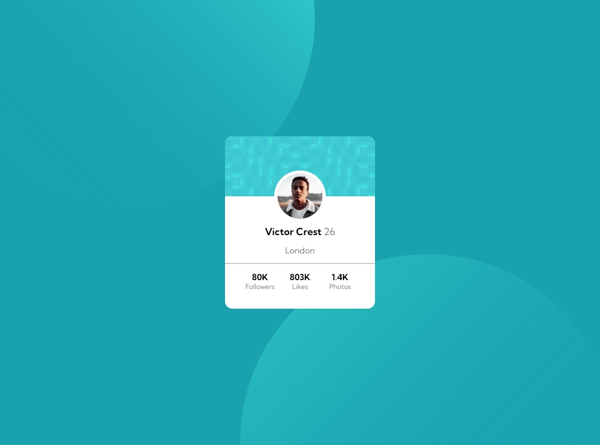
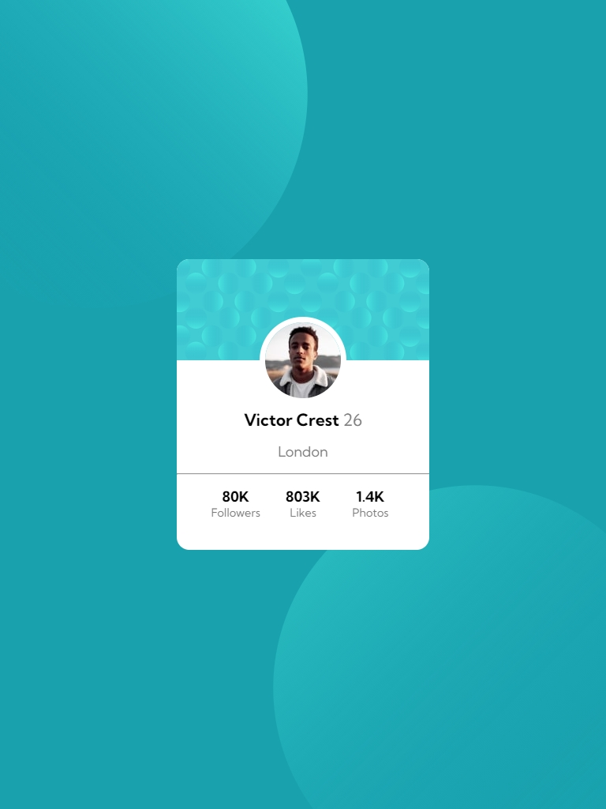
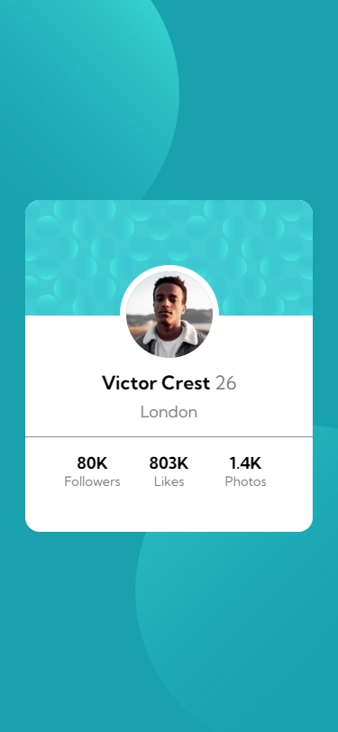
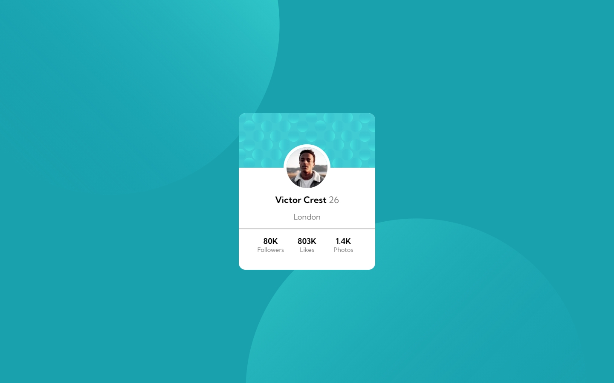
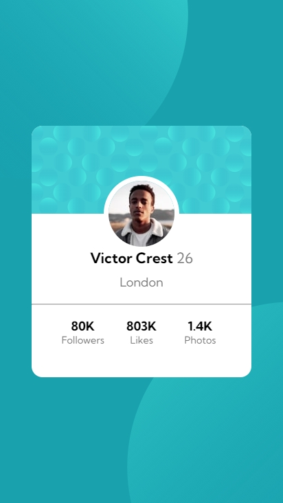

# Frontend Mentor - 3-column preview card component solution

This is a my solution to the Profile Card Challenge on [Frontend Mentor](https://www.frontendmentor.io/). 

## Table of contents

- [Overview](#overview)
  - [The challenge](#the-challenge)
  - [Screenshot](#screenshot)
  - [Links](#links)
- [My process](#my-process)
  - [Built with](#built-with)
  - [What I learned](#what-i-learned)
  - [Continued development](#continued-development)
  - [Useful resources](#useful-resources)
- [Author](#author)

## Overview

### The challenge

Users should be able to:

- View the optimal layout depending on their device's screen size
- See hover states for interactive elements

### Screenshot

Generic Laptop

iPad

iPhone X

Macbook Air

Nexus 6

### Links

- Solution URL: [Source on GitHUb](https://github.com/VincentX33/profile-card-challenge)
- Live Site URL: [Live Site](https://vincentx33.github.io/profile-card-challenge/)

## My process

### Built with

- Semantic HTML5 markup
- CSS custom properties
- Flexbox
- Mobile First workflow

### What I learned
A rather simple challenge (perhaps) to experienced web developers tested my research and googling skills. A simple looking site that was a headache to turn responsive. The static layout was very easy to achieve (mobile-first), but I had to traverse the internet to find ways to display and position two-image backgrounds. I have used flexbox for ease of placement and to attain correct display of the inner container.
My mistakes include using too many responsive units: aka vh and vw. What I should have done is placed specific static width/height once certain breakpoints were reached. The greatest amount of time went in making sure that the two balls (pun intended) were oriented correctly. 

### Continued development
Would like to add animations and transitions to the site.

### Useful resources

- [Responsively](https://responsively.app/) : Would have been very difficult to work on responsive design without responsively. Thanks to the web developer on twitter who recommended it. It gives you the ability to use premade device screen templates as well as make your own. There is even a responsive mode to drag and change screen parameters. 

## Author

- Frontend Mentor - [@VincentX33](https://www.frontendmentor.io/profile/VincentX33)
- Twitter - [@V1nceeeent](https://www.twitter.com/V1nceeeent/)
- Hashnode - [@VincentDsouza](https://hashnode.com/@VincentDsouza)